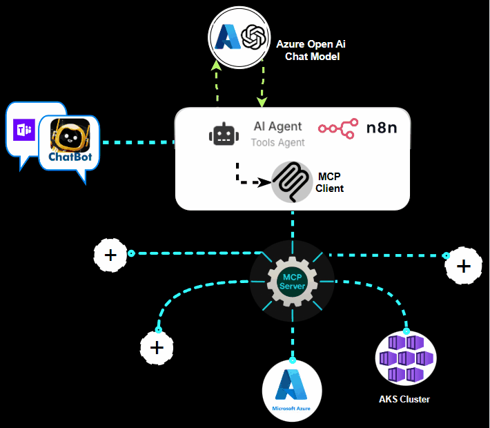

# DevOps AI Agent - n8n Workflow



This folder contains n8n workflows for a DevOps AI agent chatbot that integrates with Telegram and connects to multiple MCP (Model Context Protocol) servers for various DevOps operations.

## Overview

The workflow creates an intelligent chatbot that can:
- Receive messages via Telegram
- Process DevOps-related queries using AI
- Connect to any MCP server for resource management and operations
- Maintain conversation context using memory
- Provide clear, human-readable responses

## Architecture

```
Telegram → n8n Workflow → AI Agent → MCP Servers
                ↓
        Azure OpenAI (GPT-4) + Memory
                ↓
        Any MCP Server (Configurable Ports)
```

## Prerequisites

- Docker installed
- Azure OpenAI API access
- Telegram Bot Token
- MCP Servers running on desired ports

## Setup Instructions

### Option 1: Run n8n with Docker Compose

Create a `docker-compose.yml` file in the project root:

```yaml
version: '3.8'

services:
  n8n:
    image: n8nio/n8n:latest
    container_name: n8n-devops-ai
    restart: unless-stopped
    ports:
      - "5678:5678"
    environment:
      - N8N_BASIC_AUTH_ACTIVE=true
      - N8N_BASIC_AUTH_USER=admin
      - N8N_BASIC_AUTH_PASSWORD=your_secure_password
      - N8N_HOST=localhost
      - N8N_PORT=5678
      - N8N_PROTOCOL=http
      - WEBHOOK_URL=http://localhost:5678/
      - GENERIC_TIMEZONE=UTC
    volumes:
      - n8n_data:/home/node/.n8n
    networks:
      - n8n_network

volumes:
  n8n_data:

networks:
  n8n_network:
    driver: bridge
```

Start with:
```bash
docker-compose up -d
```

### Option 2: Run n8n with Docker Command

```bash
docker run -dit --rm --name n8n -p 5678:5678 -v n8n_data:/home/node/.n8n docker.n8n.io/n8nio/n8n
```

Access n8n at: http://localhost:5678

### Configure Credentials

In n8n, set up the following credentials:

#### Azure OpenAI
- **Name**: Azure Open AI account
- **API Key**: Your Azure OpenAI API key
- **Endpoint**: Your Azure OpenAI endpoint
- **Model**: gpt-4o

#### Telegram Bot
- **Name**: Telegram account 2
- **Bot Token**: Your Telegram bot token

### Import Workflow

1. Open n8n at http://localhost:5678
2. Click "Import from file" or "Import from URL"
3. Select the workflow file from this folder:
   - `devon_TELE.json` - Main DevOps AI agent workflow
   - `devon.json` - Alternative workflow (if available)

### Configure MCP Servers

The workflow is designed to work with any MCP server. Update the MCP Client Tool nodes with your server endpoints:

```
http://host.docker.internal:[PORT]/sse
```

Replace `[PORT]` with your MCP server's port number.

## Workflow Components

### 1. Telegram Trigger
- Listens for incoming messages from Telegram
- Configured with webhook for real-time message processing

### 2. AI Agent
- Uses Azure OpenAI GPT-4 model
- Processes user queries and determines appropriate actions
- Connects to MCP servers for operations

### 3. MCP Client Tools
- **Azure MCP**: Connects to Azure MCP server for resource management
- **Kubernetes MCP**: Connects to Kubernetes MCP server for cluster operations
- **Custom MCP**: Can be added for any other MCP server

### 4. Memory Buffer
- Maintains conversation context
- Uses chat ID for session management
- Stores last 30 interactions

### 5. Telegram Response
- Sends AI responses back to Telegram
- Formats output for human readability

## Configuration Details

### Azure Environment
The workflow is pre-configured with:
- **Tenant ID**: 61820f86-d873-4fcd-9dca-5e4b56a827fe
- **Subscription ID**: 8337c4b9-066a-497f-921c-b26a453d3325

### System Prompt
The AI agent is configured with a specialized system prompt that:
- Provides access to MCP tools
- Includes pre-configured Azure credentials
- Focuses on DevOps-related tasks
- Ensures clear, friendly responses

## Security Considerations

- Use strong passwords for n8n basic auth
- Secure your Azure OpenAI API keys
- Protect your Telegram bot token
- Consider using HTTPS in production
- Regularly update Docker images

## Development

### Adding New MCP Servers
1. Add new MCP Client Tool node
2. Configure SSE endpoint with your server's port
3. Connect to AI Agent
4. Update system prompt if needed

### Customizing Responses
- Modify the system prompt in the AI Agent node
- Adjust memory buffer settings
- Customize response formatting

---

**Note**: This workflow is designed for development and testing purposes. For production use, ensure proper security measures and monitoring are in place. 